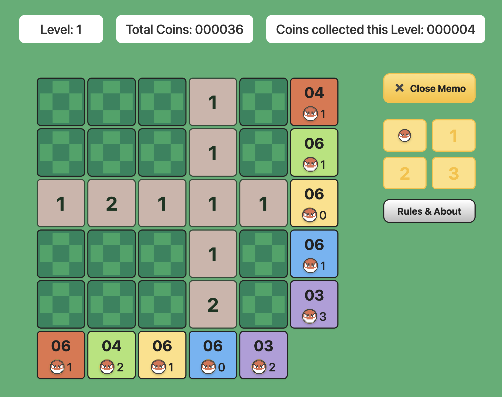

# Voltorb Flip (Next.js Edition)

A modern, serverless web recreation of the Voltorb Flip minigame from Pokémon HeartGold & SoulSilver.

---

## 🚀 Project Structure

- **voltorb-flip-next/** — Main Next.js 14+ app (all code lives here)
  - `src/`
    - `app/` — Next.js app directory (pages, API routes, layout)
    - `components/` — React UI components
    - `lib/` — Game logic and state management (e.g., `gameStore.ts`)
    - `services/` — Client-side API service wrappers
    - `styles/` — CSS (Tailwind and custom)
    - `types/` — TypeScript types
  - `public/` — Static assets (images, favicon, etc.)
  - `package.json`, `tsconfig.json`, `postcss.config.js`, etc.

---

## 🛠️ Tech Stack

- **Framework:** [Next.js 14+](https://nextjs.org/) (App Router, serverless API routes)
- **Language:** TypeScript, React 18
- **Styling:** Tailwind CSS 4, custom CSS modules
- **State:** Game state managed via cookies (no database needed)
- **Deployment:** [Vercel](https://vercel.com/) (fully serverless, no backend required)

---

## 🌐 Live Demo

[Play Voltorb Flip Online](https://voltorb-flip-murex.vercel.app/)

---

## ✨ Features
- Classic 5x5 Voltorb Flip gameplay
- Responsive UI for desktop and mobile
- Memo system for marking tiles
- Progressive difficulty and level-ups
- Coin collection and tracking
- Playable on all modern browsers

---

## 🤝 Contributing
Pull requests and issues are welcome! Please open an issue for bugs or feature requests.

---

## 📄 License & Credits
- This is a fan project for educational and entertainment purposes only.
- Pokémon, Voltorb Flip, and related assets are © Nintendo/Game Freak.
- Inspired by [Brandon Stein's Voltorb Flip](https://www.brandonstein.com/projects/voltorbflip).

---

> "Enjoy flipping!"

© 2025 Abhinav K. All rights reserved.